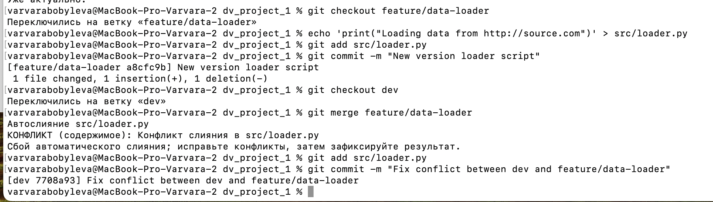
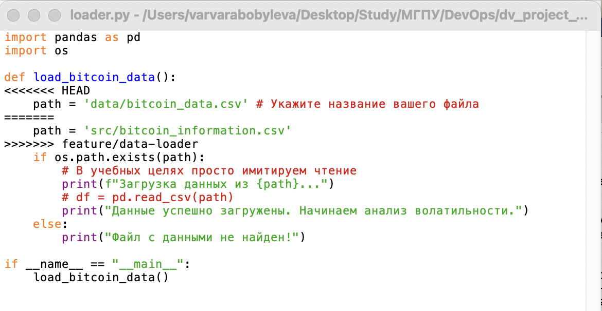
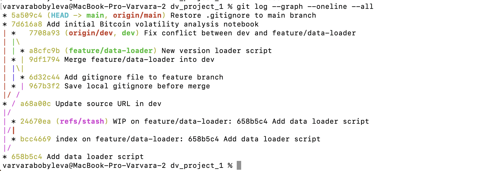

# Проект: Анализ волатильности криптовалют (Bitcoin)
**Исполнитель:** Бобылева ВВ  
**Группа:** БД-251м 
**Вариант:** №2 

## Описание проекта
Скрипт сбора исторических данных Bitcoin (API Connector).

## Выполнение этапов
1. Настроено окружение macOS, сгенерированы SSH-ключи.
2. Инициализирован Git-репозиторий с DS-структурой.
3. Проведена симуляция конфликта в ветке `dev` и его разрешение.
4. Оформлено слияние dev в main через интерфейс GitHub/GitVerse.
5. Установлен тег версии `v0.1-alpha`.

## Скриншоты

