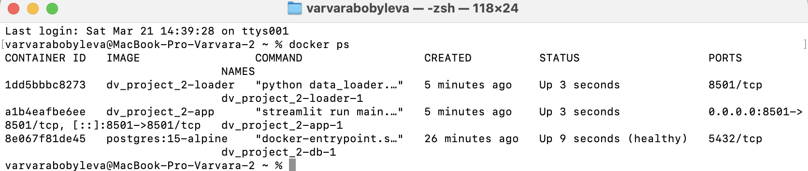
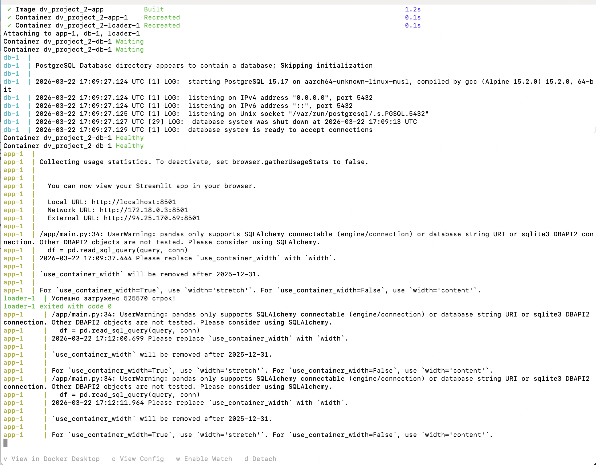

**Исполнитель:** Бобылева ВВ  **Группа:** БД-251м  **Вариант:** №2 

---

# 📈 Crypto Volatility Analytics App 🚀

Интерактивный дашборд для анализа волатильности криптовалют. Проект полностью контейнеризирован и готов к масштабированию.

## 🛠 Технологический стек
- **Backend:** Python 3.10-slim (оптимизированный Docker-образ)
- **Frontend:** Streamlit + Plotly (интерактивные графики)
- **Database:** PostgreSQL 15 (alpine)
- **Orchestration:** Docker Compose с Healthchecks и сетями

---

## 📸 Демонстрация работы

### 1. Работа инфраструктуры (Docker Status)
На скриншоте ниже видно, что все сервисы запущены. База данных прошла проверку `healthcheck` (статус **healthy**), а приложение доступно на порту 8501.

 

### 2. Скринкаст работы дашборда
Здесь показано, как работает интерфейс: загрузка случайных 1000 свечей, расчет волатильности и интерактивные графики.


> **Примечание:** Если скринкаст не запускается, вы можете найти его в папке `/screenshots/demo.mp4`, а также просмотреть скриншоты дашборда в папке `/screenshots/demo_scren_1.png` и `/screenshots/demo_scren_2.png` этого репозитория.

---

## 🏗 Архитектура и Best Practices

Выполнены требования по оптимизации:
- **Dockerfile**: Используется непривилегированный пользователь (`UID 1000`), слои кэшируются, лишние файлы исключены через `.dockerignore`.
- **Docker Compose**: 
    - Настроена изолированная сеть `backend-network`.
    - Использованы `named volumes` для БД (данные не теряются).
    - Реализован `bind mount` для папки с сырыми данными (`readonly`).
- **Healthcheck**: Приложение и загрузчик ждут готовности БД перед стартом.


---

## ⚙️ Инструкция по запуску

1. Склонируйте репозиторий.
2. Создайте файл `.env` (см. `.env.example`).
3. Положите датасет в `data/crypto_data.csv`.
  > **Примечание:** Готовый датасет можно скачать по ссылке <a href="https://www.kaggle.com/datasets/yamqwe/cryptocurrency-extra-data-bitcoin">https://www.kaggle.com/datasets/yamqwe/cryptocurrency-extra-data-bitcoin</a>
5. Выполните запуск:
   ```bash
   docker-compose up --build
